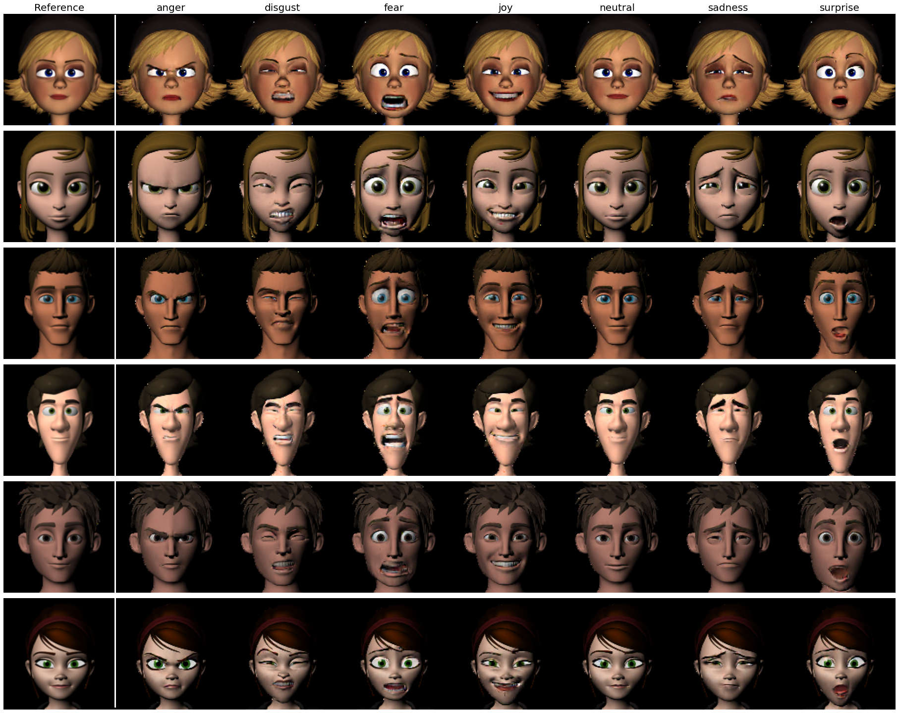

# Explore the Expression: Facial Expression Generation using Auxiliary Classifier Generative Adversarial Network


This is the implementation of the FExGAN proposed in the following article:

[Explore the Expression: Facial Expression Generation using Auxiliary Classifier Generative Adversarial Network](https://www.arxiv.com)

FExGAN takes input an image and a vector of desired affect (e.g. angry,disgust,sad,surprise,joy,neutral and fear) and converts the input image to the desired emotion while keeping the identity of the original image.



# Requirements

In order to run this you need following:

* Python >= 3.7
* Tensorflow >= 2.6
* CUDA enabled GPU (e.g. GTX1070/GTX1080)


# Usage

You can either run this on google colab or run it on your local system

* Install the pre-requisites
* Download the models (if any link fails in the notebook due to google drive restriction, try downloading them manually)
* Execute the rest of the notebook

# Citation

If you use any part of this code or use ideas mentioned in the paper, please cite the following article.

```
@article{Siddiqui_FExGAN_2022,
  author = {{Siddiqui}, J. Rafid},
  title = {{Explore the Expression: Facial Expression Generation using Auxiliary Classifier Generative Adversarial Network}},
  doi = {10.0000/00000},
  journal = {ArXiv e-prints},
  archivePrefix = "arXiv",
  keywords = {Deep Learning, GAN, Facial Expressions},
  year = {2022}
}

```
